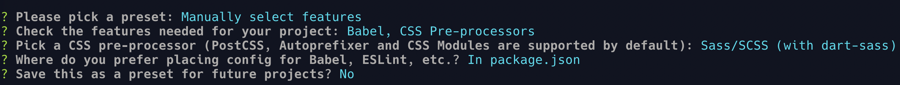

# eaglejs-slideshow

```bash
npx vue create eaglejs-slideshow
idea eaglejs-slidesho
cd eaglejs-slideshow
npm i -E eagle.js animate.css
```



```bash
idea eaglejs-slidesho
cd eaglejs-slideshow
npm i -E eagle.js animate.css
npm run serve
```

see: https://www.youtube.com/watch?v=AQMuUyL05k4
